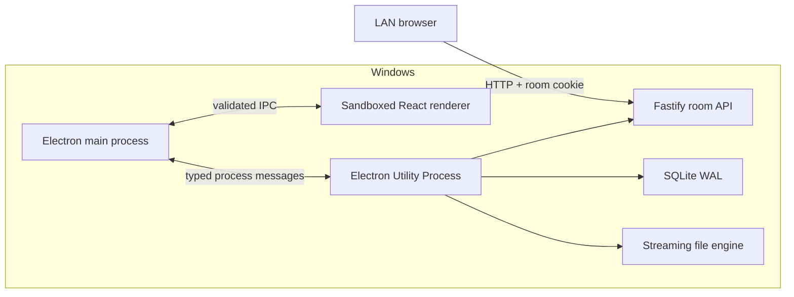

# Architecture

## 対象範囲

Local File Transfer は hosted web service ではなく、local-first の desktop product です。1 つの Windows process group が room、persistence、file endpoint を所有し、同じ LAN 上の端末が通常の browser から参加します。

Central rendezvous、cloud relay、account、analytics、automatic update backend はありません。

## Process ごとの責務

| Component | 責務 | 行ってはいけないこと |
| --- | --- | --- |
| Electron main | Window lifecycle、native file dialog、`safeStorage`、Utility Process supervision、power-save blocking、navigation/permission policy | 未検証の network input を処理する、renderer へ Node を公開する |
| Renderer | Compact desktop UI と、検証済み preload API の呼び出し | 任意 path を読む、Node integration を使う、remote content へ navigate する |
| Utility Process | Fastify、SQLite、file stream、hash worker、room cleanup、diagnostics | UI を表示する、schema validation なしに message を信頼する |
| Browser UI | Room authorization、upload、download、event reconciliation、Shared text | Capability を現在の URL/session flow 外へ保持する、clipboard を自動的に読む |

Utility Process boundary により、network と file workload を Electron browser process から分離します。Service が予期せず終了した場合は main process が検知して再起動し、SQLite の committed offset と partial file length を再照合します。

## 起動シーケンス

1. Electron が single-instance lock を取得し、security policy を設定します。
2. Utility Process が既定では `0.0.0.0:8787` で Fastify を起動します。
3. Service が private IPv4 adapter を順位付けし、到達可能性の高い LAN origin を選択します。
4. Random room ID と 256-bit capability で room を作成します。SQLite に保存するのは capability 本体ではなく verifier です。
5. Electron は service recovery 用 capability を Windows `safeStorage` で保持します。
6. Join URL を SpecQR SVG として desktop UI に表示します。
7. Browser は URL fragment の capability を `HttpOnly` room ticket と交換し、以後は cookie-authenticated API を使用します。

Service は全 interface に bind したままです。Adapter が変わった場合は listener や room を作り直さず、preferred base URL と QR を更新できます。

## Persistence

SQLite repository は versioned schema、対応環境での strict table、foreign key、WAL、transaction、busy timeout、cascade cleanup を使用します。

保存する情報:

- Room、capability verifier hash、lifetime、selected base URL
- Browser ticket verifier hash と expiry
- Transfer item metadata、direction、state、committed offset、checksum、source identity
- 上限付き idempotency record と replayable event metadata
- Shared text の nonce、ciphertext、authentication tag、revision、timestamp

File content は SQLite に保存しません。Browser upload は partial file に書き込み、exact length と digest を検証した後だけ完成 file へ atomic rename します。Windows source file は元の場所から stream し、response ごとに source identity を再検証します。

## Data path

### Browser から Windows

Browser は選択 file の fingerprint を計算し、item を register または resume します。`HEAD` で authoritative offset を確認し、最大 4 MiB の checkpoint を `PATCH` します。

Server は size、SHA-256、offset、disk write、`fsync`、SQLite commit がすべて成功した後だけ offset を acknowledge します。Mobile file provider の挙動を安定させるため、queue concurrency の既定値は 1 です。1 file の失敗で後続 file を停止しません。

### Windows から Browser

Desktop は privileged IPC を通じて native source metadata を register します。Fastify は `HEAD`、`Range`、`If-Range`、ETag、source-change check を伴って stream します。

Whole-file hash は上限付き worker pool で計算し、path/size/mtime cache を使用します。複数 source は、一時 archive を作らず streaming ZIP として返せます。

### Shared text

Room ごとに 1 件の note を optimistic revision で管理します。Event stream に含めるのは revision と timestamp だけで、content は authenticated endpoint から取得します。

SQLite へは AES-256-GCM ciphertext を保存します。At-rest key の derivation と zeroization は [SHARED_TEXT_DESIGN.md](SHARED_TEXT_DESIGN.md) を参照してください。

## State synchronization

Room snapshot が authoritative state です。Server-Sent Events は room ごとに単調増加する event ID と上限付き履歴を持ち、`Last-Event-ID` replay に対応します。

Heartbeat は connection を維持します。Event を失った場合、5 秒間隔の polling fallback、`visibilitychange`、`pageshow`、reload 時の snapshot reconciliation により収束します。

## Resource と lifecycle の上限

既定値:

- 100 item / room
- 4 GiB / file
- 20 GiB / room
- 4 MiB / upload checkpoint
- 64 MiB の disk reserve
- 15 分の sliding room TTL
- 1 時間の hard room TTL

Active request、SSE client、source hash worker、open stream、idempotency record、event history、log はそれぞれ独立して上限を持ちます。

Reset は現在の room credential を無効化し、unfinished upload と encrypted note state を削除し、memory 上の key を zeroize して、新しい capability と QR を作成します。Expiry でも同じ server-side cleanup を行います。

## UI geometry

Desktop content は 300 CSS pixel の固定幅を基準に設計しています。1 つの正方形領域が QR と file drop の表示を切り替えます。

Window は queue row 3 件まで自動的に縦へ伸び、4 件目以降は queue だけが scroll します。利用者が手動で広げた高さは縮めません。Mobile action は sticky control で到達可能にします。

Stable grid track、明示的な `aspect-ratio`、scrollbar gutter の管理により、state、language、scrollbar の変化で window width や control position が動かないようにします。
